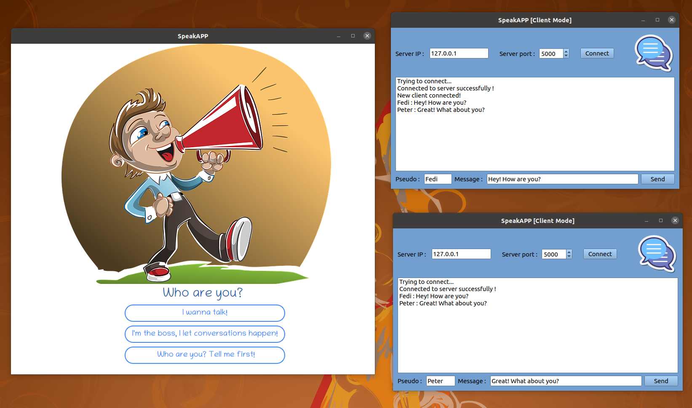
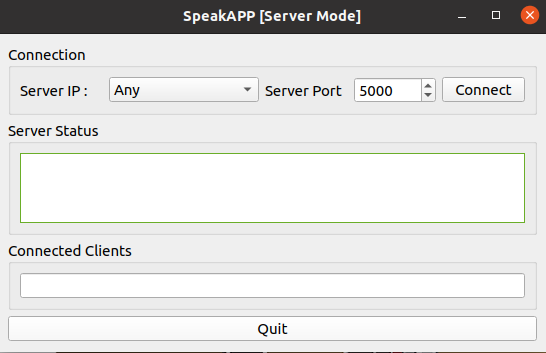
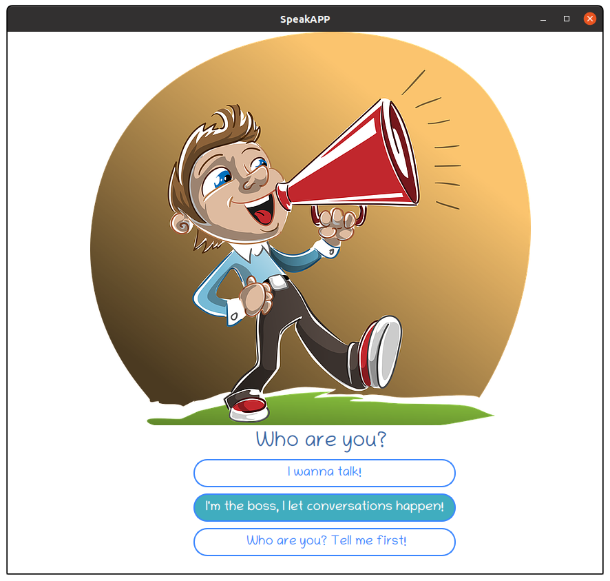
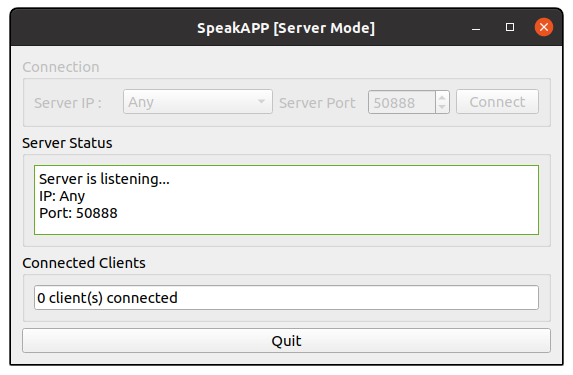
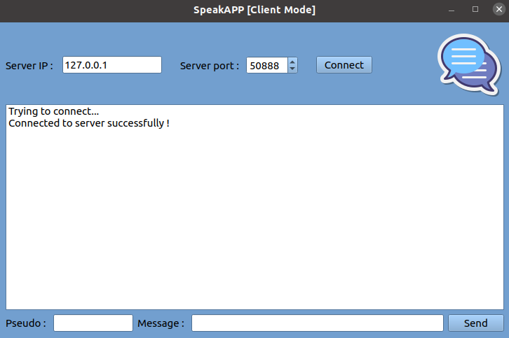

## SpeakAPP

   

SpeakAPP is a chat application built for the [Udacity C++ Nanodegree Program](https://www.udacity.com/course/c-plus-plus-nanodegree--nd213) final course. The application is built using Qt5 framework based on the "Client-Server" network architecture. Each client should connect to the server to be able to send/receive messages. The server receives messages from any connected client, and then send the message to the other clients.

The application has 2 modes: 
1. `Server Mode`: At least one server should be running to be able to run and receive messages.

2. `Client Mode`: Users send and receive messages when the application is running in this mode. 

## Code Structure
These files contain the main classes of the application:
1. `clientcommunication.h`: Contains `ClientCommunication` class. This class is responsible for sending/receiving messages from/to the server. It owns the communication socket and the messages model. Implemented in `clientcommunication.cpp` source file.
2. `clientwindow.h`: Contains `ClientWindow` class. This class is responsible for the creation of the client window. It owns a ClientCommunication object that is resposbile for TCP client connection. Implemented in `clientwindow.cpp` source file.
3. `modewindow.h`: Contains `ModeWindow` class. This class is responsible for the creation of the mode window. It owns a client window and a server window. It creates client/server window depending on the user choice. Implemented in `modewindow.cpp` source file.
4. `servercommunication.h`: Contains `ServerCommunication` class. This class is responsible for sending/receiving messages from/to clients. It owns the tcp server object and the clients sockets. Implemented in `servercommunication.cpp` source file.
5. `serverwindow.h`: Contains ServerWindow class. This class is responsible for the creation of the server window. It owns a ServerCommunication object that is resposbile for TCP server connection. Implemented in `serverwindow.cpp` source file.

## Dependencies (Linux)
The application depends on [Qt5](https://www.qt.io/). The build script `speakapp_build.sh` installs this dependency. The versions required are Qt 5.12.8 and qmake 3.1. 

## Build Instructions (Ubuntu 16.04 LTS) (Other platforms will be added in the future)
1. Clone this repo.
2. Run the build script `speakapp_build.sh`. If the application is successfully built, the `../build` build directory is created.

## Run Instructions
1. From the build directory `build/`, run the application using `./SpeakAPP`
2. Click on `I'm the boss, I let conversations happen!` button. This will start the server.

3. Choose IP and Port (e.g. `Any` and `50888`) and click on `Connect`.

4. Now, open the application in the first client machine. If you are using `Any` as the server IP, you can open the application in the same machine. Click on `I wanna talk!` button. This will open the application in `Client` mode.

5. Enter IP and Port. If you're running the server and the client on the same machine use the loopback IP 127.0.0.1.

6. Repeat steps 4-5 and open a second client. Now you can send and receive messages between the first and second clients.

## Rubric Points
1. README: `README.md` file.
2. Compiling and Testing: `speakapp_build.sh` script is used to build the project. It uses `qmake` and `make` build system.
3. Loops, Functions, I/O: 
	- The project code is clearly organized into functions and classes. Example: `servercommunication.cpp` file.
	-  The project accepts input from a user as part of the necessary operation. This is done using the GUI. Example: `Mode Window`, `Client Window`, `Server Window`
4. Object Oriented Programming: The project implements OOP principles. Example: `serverwindow.cpp`.
5. Memory Management: The projects uses smart pointers (see `clientwindow.h` and `serverwindow.h`). It also uses Destructors properly and implements RAII.
6. Concurrency: The project is multithreaded. Example: `ServerWindow::showNumberClients()` method in `serverwindow.cpp` source file.

## Authors
* **Fedi Salhi** [Linkedin](https://www.linkedin.com/in/fedisalhi/)

