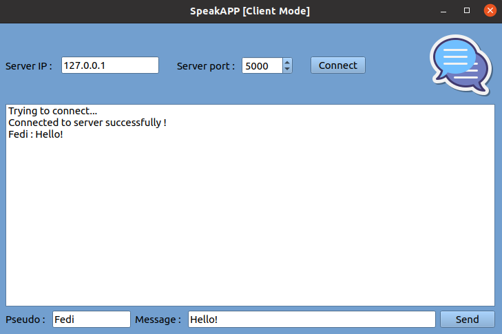

## SpeakAPP

SpeakAPP is a chat application built for the [Udacity C++ Nanodegree Program](https://www.udacity.com/course/c-plus-plus-nanodegree--nd213) final course. The application was built using Qt5 framework based on the "Client-Server" network architecture. Each client should connect to the server to be able to send messages. The server receives messages from any connected client, and then send the message to the other clients.

The application has 2 modes: 
1. Server Mode: At least one server should be running to be able to run and receive messages.

2. Client Mode: Users send and receive messages when the application is running in this mode. 

## Dependencies (Linux)
The application depends on [Qt5](https://www.qt.io/). The build script `speakapp_build.sh` installs this dependency.

## Build Instructions
1. Clone this repo.
2. Run the build script `speakapp_build.sh`. If the application is successfully built, the `../Build-SpeakAPP-Desktop-Debug` build directory is created.

## Run Instructions
1. From the build directory `Build-SpeakAPP-Desktop-Debug`, run the application using `./SpeakAPP`
2. Click on `I'm the boss, I let conversations happen!` button. This will start the server.

3. Choose IP and Port (e.g. `Any` and `50888`) and click on `Connect`.

4. Now, open the application in the first client machine. If you are using `Any` as the server IP, you can open the application in the same machine.
5. Click on `I wanna talk!` button. This will open the application in `Client` mode.

6. Enter IP and Port. If you're running the server and the client on the same machine use the loopback IP 127.0.0.1.

7. Repeat 4-5-6 steps to open a second client. Now you can send and receive messages between the first and second clients.

## Authors
* **Fedi Salhi** [Linkedin](https://www.linkedin.com/in/fedisalhi/)

